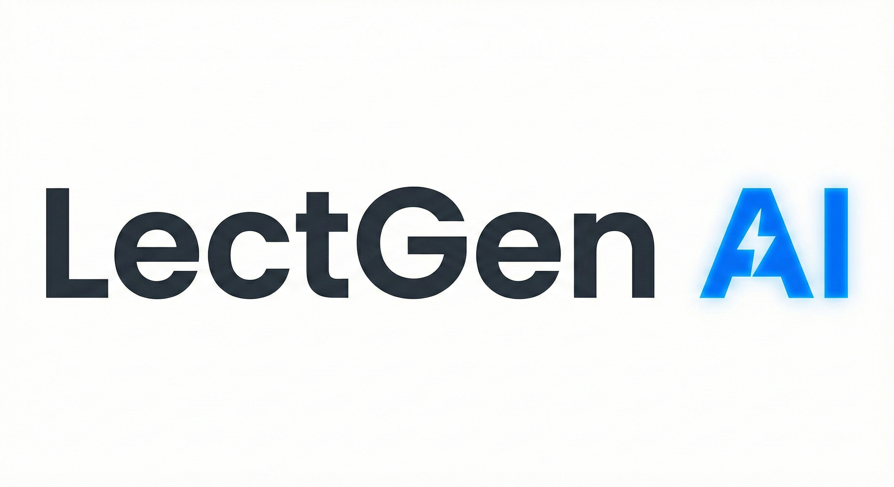

# Lectgen AI

<div align="center">



<br/>

### Built with


<br/>

[](LICENSE)

**AI-Powered Presentation Generation Platform**

Transform your ideas into professional presentations using text, voice, or template images.

[Features](#key-features) • [Architecture](#architecture) • [Tech Stack](#tech-stack) • [Getting Started](#getting-started) • [API Documentation](#api-documentation)

</div>

---

## Overview

Lectgen AI is an intelligent presentation generation platform that leverages advanced AI models to automatically create professional slide decks. Users interact through an intuitive ChatGPT-style interface with support for multimodal inputs including text descriptions, voice recordings, and template images.

### Key Features

- 🤖 **AI-Powered Generation** - Utilizes Google Gemini via LangChain for intelligent content creation
- 🎙️ **Voice Input** - Convert speech to presentations with Whisper speech-to-text
- 🎨 **Template Analysis** - Upload reference slides to match your desired style
- 💬 **Conversational Interface** - ChatGPT-like experience for iterative design
- 👥 **Multi-tier System** - FREE and VIP plans with different capabilities
- 📊 **Admin Dashboard** - Comprehensive analytics and user management

### Problem Statement

- **Time-consuming** - Educators and students spend hours creating presentations
- **Design challenges** - Not everyone has design expertise or access to quality templates
- **Inefficient workflows** - Need rapid conversion from ideas (text/voice) to finished slides

---

## Architecture

### System Overview

```
┌─────────────────┐      ┌──────────────────────────────────────┐      ┌──────────────┐
│    Frontend     │─────▶│            Backend                   │─────▶│   Database   │
│  React + TS     │◀─────│          Node.js + TS                │◀─────│  PostgreSQL  │
└─────────────────┘      │                                      │      └──────────────┘
                         │  ┌────────────────────────────────┐  │
                         │  │  LangChain → Gemini AI         │  │
                         │  │  Generate Content Structure    │  │
                         │  └────────────────────────────────┘  │
                         │              ↓                       │
                         │  ┌────────────────────────────────┐  │
                         │  │  Backend LaTeX Builder         │  │
                         │  │  Content → LaTeX Code          │  │
                         │  └────────────────────────────────┘  │
                         │              ↓                       │
                         │  ┌────────────────────────────────┐  │
                         │  │  LaTeX Compiler                │  │
                         │  │  LaTeX → PDF                   │  │
                         │  └────────────────────────────────┘  │
                         └──────────────────────────────────────┘
                               │
                               ├─▶ MinIO (Storage)
                               └─▶ Whisper (STT)
```

### Core Components

#### Frontend Architecture

```
frontend/src/
├── pages/
│   ├── Auth/         # Authentication pages
│   ├── Dashboard/    # Main chat interface
│   ├── Settings/     # User preferences
│   ├── Payment/      # Subscription management
│   └── Admin/        # Admin panel
├── components/       # Reusable UI components
├── hooks/           # Custom React hooks
└── services/        # API integration layer
```

**Main Interface Features:**

- **Chat Area** - Conversation history with slide previews and download options
- **Input Panel** - Three modes: Text, Audio, and Template upload
- **Sidebar** - Conversation history, user profile, and usage statistics
- **Settings** - Account management and subscription controls

#### Backend Architecture

```
backend/src/modules/
├── auth/          # JWT-based authentication
├── user/          # User profile management
├── conversation/  # Chat session handling
├── chat/          # Message processing
├── ai/            # LangChain + Gemini integration (content generation)
├── latex/         # LaTeX builder (convert content → LaTeX syntax)
├── speech/        # Whisper STT service
├── template/      # Image style analysis
├── file/          # MinIO file operations
└── admin/         # Analytics and monitoring
```

### Data Flow

**Text to Slides:**

```
User Input → Chat API → LangChain + Gemini (Generate Content) →
Backend LaTeX Builder (Content → LaTeX) → LaTeX Compiler → PDF → Storage
```

**Voice to Slides:**

```
Audio Upload → Whisper STT → Text → Chat API → LangChain + Gemini (Generate Content) →
Backend LaTeX Builder → LaTeX Compiler → PDF
```

**Template-based:**

```
Image Upload → Vision Analysis → Style Prompt → LangChain + Gemini (Generate Content) →
Backend LaTeX Builder (Apply Style) → LaTeX Compiler → PDF
```

---

## Tech Stack

### Frontend

- **Framework:** React 18 + TypeScript
- **Styling:** Tailwind CSS + Ant Design
- **State Management:** React Context / Redux
- **Build Tool:** Vite / Webpack

### Backend

- **Runtime:** Node.js 20+
- **Framework:** Express.js + TypeScript
- **ORM:** Sequelize
- **Authentication:** JWT (HTTP-only cookies)

### Database & Storage

- **Primary DB:** PostgreSQL
- **File Storage:** MinIO (S3-compatible)
- **Session Store:** Redis (optional)

### AI & ML Services

- **AI Framework:** LangChain
- **LLM Model:** Google Gemini API (gemini-1.5-flash, gemini-2.0-flash-exp)
  - Role: Generate structured content (titles, sections, bullet points)
- **Speech-to-Text:** OpenAI Whisper
- **LaTeX Builder:** Backend service to convert content structure → LaTeX syntax
- **LaTeX Compilation:** Backend LaTeX Compiler (TexLive/MiKTeX)
- **PDF Generation:** Complete pipeline: Content → LaTeX → PDF

### DevOps

- **Containerization:** Docker + Docker Compose
- **CI/CD:** GitHub Actions
- **Monitoring:** (To be configured)

---

## Database Schema

### Core Tables

**Users**

```sql
id, email, name, avatarUrl, passwordHash
role (FREE/VIP/ADMIN), slidesGenerated, maxSlidesPerMonth
subscriptionExpiresAt, createdAt, updatedAt
```

**Conversations**

```sql
id, userId, title, createdAt, updatedAt
```

**Messages**

```sql
id, conversationId, role (USER/ASSISTANT), messageType (TEXT/AUDIO/IMAGE)
contentText, audioUrl, imageUrl, transcript, styleAnalysis (JSONB)
pdfUrl, slideCount, createdAt
```

**Sessions**

```sql
id, userId, refreshToken, expiresAt
```

**UsageLogs**

```sql
id, userId, actionType, status, metadata (JSONB), createdAt
```

---

## Getting Started

### Prerequisites

- Node.js 20+ and npm
- Docker & Docker Compose
- PostgreSQL 14+
- MinIO server (or S3-compatible storage)

### Environment Setup

1. **Clone the repository**

```bash
git clone git@github.com:The-GenLab/Lectgen-AI.git
cd Lectgen-AI
```

2. **Configure environment variables**

```bash
cp .env.example .env
# Edit .env with your API keys and configuration
```

3. **Install dependencies**

```bash
# Root dependencies
npm install

# Backend dependencies
cd backend && npm install

# Frontend dependencies
cd ../frontend && npm install
```

4. **Start development environment**

```bash
# Using Docker Compose
docker-compose -f docker-compose.dev.yml up

# Or manually
npm run dev
```

5. **Access the application**

- Frontend: `http://localhost:3000`
- Backend API: `http://localhost:8000`
- MinIO Console: `http://localhost:9001`

### Project Structure

```
Lectgen-AI/
├── backend/              # Node.js backend service
├── frontend/             # React frontend application
├── scripts/              # Utility scripts
├── AI_doc/              # AI service documentation
├── docker-compose.dev.yml
├── Dockerfile.backend.dev
└── README.md
```

---

## API Documentation

### Authentication Endpoints

- `POST /api/auth/register` - User registration
- `POST /api/auth/login` - User login
- `POST /api/auth/refresh` - Refresh access token
- `POST /api/auth/logout` - User logout

### Chat Endpoints

- `POST /api/chat/message` - Send text message
- `POST /api/chat/audio` - Upload audio for transcription
- `POST /api/chat/template` - Upload template image
- `GET /api/chat/conversations` - List user conversations
- `GET /api/chat/conversations/:id` - Get conversation details

### User Endpoints

- `GET /api/user/profile` - Get user profile
- `PUT /api/user/profile` - Update profile
- `POST /api/user/upgrade` - Upgrade to VIP

### Admin Endpoints

- `GET /api/admin/stats` - System statistics
- `GET /api/admin/users` - User management
- `GET /api/admin/logs` - Usage logs

---

## Feature Tiers

### FREE Plan

- ✅ 5 presentations per month
- ✅ Text input only
- ✅ Basic templates
- ✅ Standard processing speed

### VIP Plan

- ✅ Unlimited presentations
- ✅ Text + Audio + Template inputs
- ✅ Premium templates with icons & charts
- ✅ Priority queue processing
- ✅ Advanced AI model (Gemini 2.0)

---

## Storage Structure (MinIO)

```
buckets/
├── audio-recordings/    # User audio uploads
├── template-images/     # Reference slide images
├── avatars/            # User profile pictures
└── latex-files/        # Generated LaTeX documents
```

---

## Contributing

This is a private project developed by The GenLab team. For internal contributors:

1. Create a feature branch from `develop`
2. Make your changes following the coding standards
3. Submit a pull request with detailed description
4. Ensure all tests pass before requesting review

---

## License

This project is proprietary software. All rights reserved.

---

## Team

Developed by **The GenLab** team

- **Project Duration:** 2 months
- **Team Size:** 5 developers

---

## Support

For issues and questions, please contact the development team or create an issue in the repository.

---

<div align="center">

**Built with ❤️ by The GenLab**

</div>
